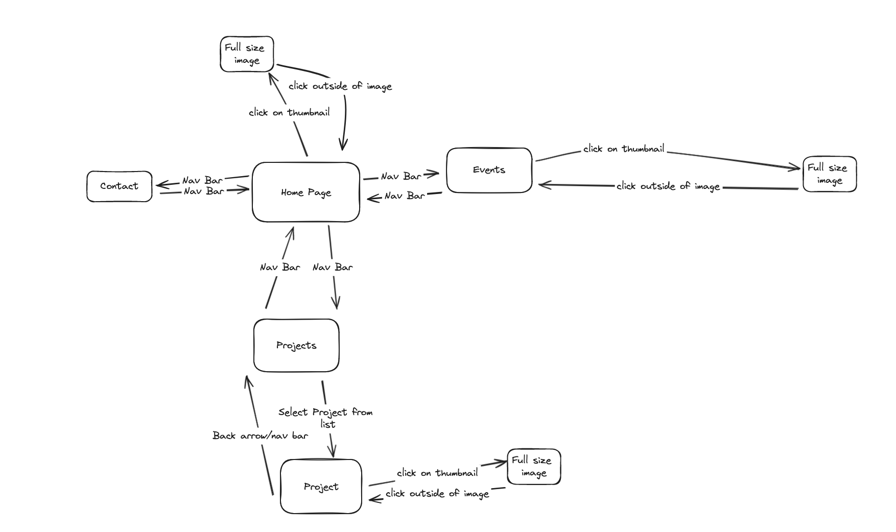
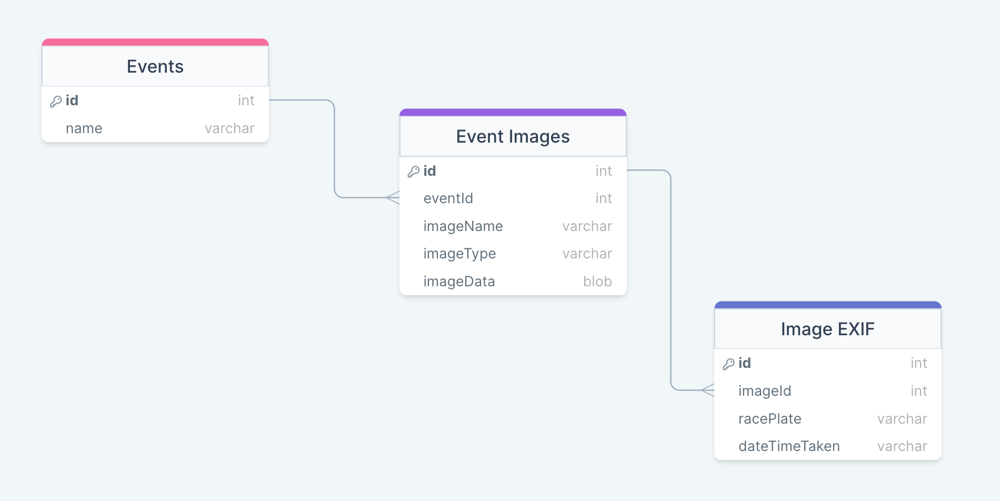

# Development of a Database-Driven Web Application for NCEA Level 3

Project Name: **Photography Portfolio Website**

Project Author: **Rory Stock**

Assessment Standards: **91902** and **91903**

-------------------------------------------------

## Documentation

- [Home](README.md)
- [Design and Review](Design.md)

-------------------------------------------------

## Design, Development and Testing Log

### Friday 30th May

Getting the image download function working

I spent quite a lot of time trying to use the google drive api to allow site users to download images however I was struggling to get this to work. I want through a number of different services and options and have ended up using cloudflare r2 storage and the s3 api through the laravel framework to give a download button. This doesn't need any of google's oauth2 authentication making it much simpler to implement. When I use this function in the website I will create a variable for the image name/path instead of a static preselected image seen in the example below.

> Replace this text with any user feedback / comments

Replace this text with notes describing how you acted upon the user feedback: made changes to design, etc.

### Friday 31st May

Working on site flow using excalidraw

Started designing how the user will navigate between pages, and making sure that there are no dead ends in the site. 

> Replace this text with any user feedback / comments

Replace this text with notes describing how you acted upon the user feedback: made changes to design, etc.

### Friday 31st May

Database design with DrawSQL

Started designing the database for the website. I may need to add more tables to the Image EXIF data table as I am not sure how many filters I will want.

> Replace this text with any user feedback / comments

Replace this text with notes describing how you acted upon the user feedback: made changes to design, etc.

### DATE HERE

Replace this test with what you are working on

Replace this text with brief notes describing what you worked on, any decisions you made, any changes to designs, etc. Add screenshots / links to other media to illustrate your notes where necessary.

> Replace this text with any user feedback / comments

Replace this text with notes describing how you acted upon the user feedback: made changes to design, etc.

### DATE HERE

Replace this test with what you are working on

Replace this text with brief notes describing what you worked on, any decisions you made, any changes to designs, etc. Add screenshots / links to other media to illustrate your notes where necessary.

> Replace this text with any user feedback / comments

Replace this text with notes describing how you acted upon the user feedback: made changes to design, etc.

### DATE HERE

Replace this test with what you are working on

Replace this text with brief notes describing what you worked on, any decisions you made, any changes to designs, etc. Add screenshots / links to other media to illustrate your notes where necessary.

> Replace this text with any user feedback / comments

Replace this text with notes describing how you acted upon the user feedback: made changes to design, etc.
