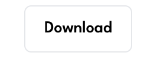

# The Design of a Database-Driven Web Application for NCEA Level 3

Project Name: **Photography Portfolio Website**

Project Author: **Rory Stock**

Assessment Standards: **91902** and **91903**

-------------------------------------------------

## Documentation

- [Home](../README.md)
- [Development and Testing](Development.md)
- [Setup and Admin Access](Setup.md)

-------------------------------------------------

## System Requirements

### Identified Need or Problem

Need a simple way to share and display my portfolio and photos from events. At the moment my event photos can only be viewed through google drive which is quite slow and not the most user friendly.

- Need a way to easily add images/events to the website
- Need a way for users to easily view and download images
- Need a way for people to easily contact me
- Need the site to be easy to navigate and user friendly
- All of the above should be more efficient than using google drive
- Everything should be aesthetically pleasing

### End-User Requirements

Owner of site: Needs to be able to easily add/update images in portfolio and somewhat automate adding event images.

Viewers of site: Members of the public. Need to be able to easily access and download images. Site needs to be fast and responsive so that it is more useful than google drive.
- It is important that the site is easy to use on mobile devices as this is likely where the majority of users, especially people looking at event photos, will be viewing the site.

Possible Clients: Need to be able to easily see examples of my work and an easy way to contact me. From a site owner perspective any contact should be sent to the site owner's email so that it is easy to keep track of.

End user feedback: For feedback I will ask for feedback from my parents. My dad used to be a professional ski/mountaineering/adventure photographer so should be able to provide some good/relevant feedback on the website.

### Proposed Solution

A website that allows users to easily access, view, and download my photos.

Admin/Owner will be able to easily add images to the website and add new events/projects from within the website
 - This would require an admin account with special permissions so that they can modify the site
    - Some of the features that should be included in the admin panel are: 
        - Ability to add new events
        - Ability to edit events
        - Ability to add images to the portfolio section

-------------------------------------------------

## Relevant Implications

### Accessibility

Ensuring that the product is available to a wide range of end users including users with different devices and abilities.

This website will likely be used on different platforms such as different mobile devices as well as desktop computers. 

This means that the website will need to be easily readable usable on different screen sizes and devices. As users are more likely to be viewing the website on mobile devices, it is important that the website is easy to use on mobile devices. If the website is cluttered with images or sections being squashed together then it will be difficult to use on mobile devices as well as not looking good or professional.

### Aesthetics

This implication relates to how the website looks

Considering that this website is a photography portfolio, it is important that the website looks good and is visually appealing.

The website should have a clean and simple design that allows the images to be the main focus. The user should be able to easily navigate the website and find the images they are looking for.

To achieve this I will need to keep a consistent colour scheme and simple but effective layout throughout the website. As images are a core part of the site and a significant part of the aesthetic, it is important that they are sized and displayed correctly. I will also need to consider which images I display on the portfolio page as the images should complement each other and be of a similar style, as well as complementing the overall design of the website.

### Consistency

This principle means that websites should be consistent in their design and layout and generally stick to conventions for UI and layout

This website should be consistent in its design and layout. This means that the user should be able to easily navigate the website and find what they are looking for.

I will need to consider how I layout the website before I start making it so that each page is consistent and easy to navigate. Things such as buttons, pop-ups, links and other similar elements should be consistent throughout the website so that there is a clear and consistent design. Although the admin page will not be seen by the public, it should still be consistent with the rest of the website so that the owner can easily navigate and use the website.

### Intellectual Property

This principle relates to the ownership of the content on the website.

Because this is a photography portfolio website, it is important that the images on the website are correctly credited with the correct metadata included in the images.

This means that I will need to ensure that images displayed on the website contain metadata that includes copyright/credit/IPTC data. When images are downloaded, this metadata should be included in the downloaded image so that the user knows who the image belongs to and how to contact them.

There should also be a clear copyright notice on the website so that users know who the images belong to. This is important as it is the owner's work and they should be credited for it.

### Functionality

This principle relates to how well the website works and whether it meets its intended purpose.

The website should do everything that it is supposed to do without crashing or running into any bugs.

This means that I wil need to properly test the website and make sure that it works as intended for a range of users. If the website does not meet the basic end user requirements then it will not be useful to the owner or the user and will not be used. All the features that I have outlined in the system requirements should be included in the website and should work as intended without any bugs.

Although it's not part of the website the viewers will see, it is very important that the admin panel is effective, responsive, and simple as this is one of the ultimate factors as to whether the website is useful or not. If the admin panel is not easy to use then the owner will not be able to easily add images to the website and the website will not be useful.

-------------------------------------------------

## Relevant User Experience (UX) Principles

### Useful

The product should be useful and fulfil a need for the user.

The product should be useful for the owner in that it provides a simple way to display their portfolio and photos from events. It should also be useful for viewers of the site in that it provides a simple way to view and download images.

I will need to make sure that it fulfils the needs of both the owner and the user by making sure that the website is easy and more efficient than just using a cloud service.

If the website is missing core features then there is little point in making, so I will need to look back at these requirements as I go to make sure they will be met.

### Findable

The website should be easy to navigate so the users can find what they are looking for.

Users may not have the best IT skills so the website should be easy to understand with each button or link clearly labelled.

Overly complex layouts or designs may make it difficult for users to find what they are looking for so I should keep the design simple while still being visually appealing.

Buttons such as expand image and download should be easy to find and use. The menu should be easy to navigate and use.

### Usable

Easy to use for end users.

The website should be easy to use for both the owner and the user. The owner should be able to easily add images to the website and the user should be able to easily find and download images.

If it is not easy to use then users will be less likely to effectively engage with the website and its content.

### Real World Match

This is one of Nielsen's 10 heuristics for usability. It means that the website design should follow concepts that the user may already be familiar with, regardless of their IT skills. Things such as red == danger, rubbish bin == delete, arrows for navigation, etc.

This means that I should use common design elements and layouts that users are already familiar with. This will make the website easier to use and navigate as users will already be familiar with the design elements.

-------------------------------------------------

## Final System Design

### Database Structure

### User Interface Design

-------------------------------------------------

## Completed System

### Database Structure

<strong>Note:</strong> Only the 'events' table and 'event_images' table are created by me. The rest are created by Laravel when setting up the project. I have modified the 'users' table though.

### User Interface Design

Home Page:
  

Events Page:
  

Contact Page:
  

View Event Page:
  

Admin Panel:
  

Add/Edit Event Panel:
  

Download Image Panel:

-------------------------------------------------

## Review and Evaluation

### Meeting the Needs of the Users and System Requirements

The key needs that had to be met were: 
- An easy way to add events and images to the website
- An easy way for users to view and download images
- An easy way for people to contact the owner
- The site should be easy to navigate and user friendly
- The site should be more efficient than using google drive
- Everything should be aesthetically pleasing

I think that these requirements were well met. It is very easy and quick to add/update/delete events from the admin panel. Things such as the event name, date, location, and the cover image can be updated at any time. When adding events the admin just needs to get the cloudflare R2 folder that the images are stored in and the urls for all the images will be added to the database automatically.

[Video with a demonstration of adding an event and updating it](https://mywaimeaschool-my.sharepoint.com/:v:/g/personal/rmstock_waimea_school_nz/EZbwJXIXJB9Ov9JNZoVQu_MBYcke5vMbCMMdP7wY6E9OJw?nav=eyJyZWZlcnJhbEluZm8iOnsicmVmZXJyYWxBcHAiOiJTdHJlYW1XZWJBcHAiLCJyZWZlcnJhbFZpZXciOiJTaGFyZURpYWxvZy1MaW5rIiwicmVmZXJyYWxBcHBQbGF0Zm9ybSI6IldlYiIsInJlZmVycmFsTW9kZSI6InZpZXcifX0%3D&e=OAxRS1)

It's also very easy to view and download images. Buttons are clearly labelled and there is a note in each event-view that images can be clicked on to download them. When images are clicked on they are displayed in a modal with a very clear download button.

[Video with a demonstration of downloading an image from an event](https://mywaimeaschool-my.sharepoint.com/:v:/g/personal/rmstock_waimea_school_nz/EYAVWMVpywVNmIb6xyBW0OgBtey2XZtQ8FbqrO8A92qQjA?nav=eyJyZWZlcnJhbEluZm8iOnsicmVmZXJyYWxBcHAiOiJTdHJlYW1XZWJBcHAiLCJyZWZlcnJhbFZpZXciOiJTaGFyZURpYWxvZy1MaW5rIiwicmVmZXJyYWxBcHBQbGF0Zm9ybSI6IldlYiIsInJlZmVycmFsTW9kZSI6InZpZXcifX0%3D&e=W47aM4)

The contact page contains a simple, easy to understand form that sends an email to the site owner on submit. The resulting email is clearly laid out with the name, email, subject, and message of the sender all shown.

[Video with a demonstration of using the contact form](https://mywaimeaschool-my.sharepoint.com/:v:/g/personal/rmstock_waimea_school_nz/EQIzodIC7EBMlFNrJaT6YfYBVO4V0f847tFRYK19t_Qz6g?nav=eyJyZWZlcnJhbEluZm8iOnsicmVmZXJyYWxBcHAiOiJTdHJlYW1XZWJBcHAiLCJyZWZlcnJhbFZpZXciOiJTaGFyZURpYWxvZy1MaW5rIiwicmVmZXJyYWxBcHBQbGF0Zm9ybSI6IldlYiIsInJlZmVycmFsTW9kZSI6InZpZXcifX0%3D&e=mlD9sd)

The site is very easy to navigate, with a clear and simple nav bar on both the desktop and mobile views. Due to the use of the HTMX HX-boost tag the nav bar is also very quick and responsive which is important for the user experience.

[Video with a demonstration of the nav bar on desktop and mobile](https://mywaimeaschool-my.sharepoint.com/:v:/g/personal/rmstock_waimea_school_nz/EZ3wq48ikZNPhJTlHozkAtwBZFkTVsKkdXpQ5e3RaU3OiA?nav=eyJyZWZlcnJhbEluZm8iOnsicmVmZXJyYWxBcHAiOiJTdHJlYW1XZWJBcHAiLCJyZWZlcnJhbFZpZXciOiJTaGFyZURpYWxvZy1MaW5rIiwicmVmZXJyYWxBcHBQbGF0Zm9ybSI6IldlYiIsInJlZmVycmFsTW9kZSI6InZpZXcifX0%3D&e=5lDkNW)

Everything is far more efficient than google drive. It's far easier to have one link to a website rather than having to manage access links for multiple drive folders. It is also massively faster to look through images as they load much faster than google drive and are displayed bigger which means that people looking for event photos don't have to spend as much time looking for the image they want.

The site follows a consistent black and white colour scheme and a consistent design theme/layout on every page. I used PinesUI as the basis for much of the site design which helped to keep it consistent and simple.

## Review of Implications

### Review of Aesthetics

The design of the website is simple and clean with a modern UI and look. The use of black and white colours throughout helps put the focus on the images while still looking good. The use of background blur on modals helps isolate images when they are clicked on which gives pages like the event view a very clean look and feel. The font used is League Spartan which is clean and modern, fitting the rest of the design. 

There is only one point in the website where a non black/white colour is used which is the delete button in the admin panel. This helps it stand out and makes it clear what the button does.
The rest of the site follows a B&W style using the TailwindCSS 'Neutral' colour palette which is a range of greys from white to black.

### Review of Consistency

Buttons, components, forms, image sizes/layouts, headers and footers are all consistent throughout the site. Sections like the head, header, nav bar, and footer are all defined in a default layout file, which the rest of the content pages extend. This ensures that the main layout is consistent on every page. 
 
The admin panel is consistent with the rest of the site, using the same buttons, components, colours and fonts. This meets the requirement that I outlined in the implications. 
 
 
 
 
 

### Review of Intellectual Property

The website footer has a copyright notice on it that clearly defines ownership. When downloaded images will still contain the metadata that was included in the original image.

Footer: 
  
Metadata in an image: 

And if someone were to download a web display image (not intended) the same metadata would be included in the downloaded image.

Webp metadata: 

<strong>Note:</strong> The metadata files are longer than shown in the images, I have just shown some of the relevant parts.

### Review of Functionality

As all of the user and system requirements were met, as well as meeting the above implications, I believe that the website is functional and meets the needs of the users and the owner. The website is easy to use and navigate, and the admin panel is simple and effective. These were the core requirements at the start and they are all well addressed in the final product. 

All of the bugs that I found during development and testing have been fixed, and the website is fully functional and viewable on both desktop and mobile devices, with a complete mobile view in some areas that changes over at defined breakpoints.

## Review of UX Principles

### Review of Usefulness

The end product fulfils all the requirements for it to be useful such as being simple, efficient, easy to view images and includes all of the core requirements that give the website a use case/purpose

### Review of Findability

Buttons are clearly labelled using either text or recognisable icons. The nav bar has only three options which are easily understandable, and its easy to understand how to navigate through the site. 
By keeping the design simple and consistent, the user can easily find what they are looking for without having to go through a cluttered or overly complex layout. This helps focus the user on the core features of the website.

### Review of Usability

The website is very easy to use on both an admin and user level. The admin panel is simple and effective, and the user can easily navigate the site and find what they are looking for. The website is also very responsive and quick to load, which is important for the user experience. By doing this it makes it more likely that the users will engage properly with the website making it more useful and usable.

### Review of Real World Match

Many of the buttons ended up being text-based so this makes them very easy to understand and real world match becomes less relevant. However in critical areas such as deleting events the button is also red to signify that users should be careful. In the admin panel there are a few icons used such as a + for adding a new event and a pencil for editing an event. These are common icons that users will be familiar with and help to make the admin panel easier to use.

Delete Button: 
 
Add Event Button: 
 
Edit Event Button: 

-------------------------------------------------

## Future additions and future proofing

### Future Additions

- In the original design I had a search bar in the view event page that would allow users to search for their race plate. I never ended up event testing this so it was never implemented. This would be a good feature to add in the future as it would make it easier for users to find their images, further improving the user experience. It would definitely be doable, but would require every image to have a race plate field assigned to it which would add more work while editing images.

- When I have more personal projects I would like to add a personal projects section to the website. This would be similar to the events section but provides a better way to display different types of work. This would be very easy to add as it would follow a very similar structure to the events section.

- When I have more experience an about me section would be a good addition to the website.

### Future Proofing

- By using a default layouts and reusable components, the website is very easy to update and add to. The use of migration files also makes it very easy to update the database structure to cover new features or changes.

- The file names are also all very easy to understand which means that if I were to come back to the project in the future I would be able to easily understand what each file does. All the files also contain useful comments that explain what each part of the code does.

- The design of the website is also fairly modern and simple which means that it should still look good in the future for a while. 

-------------------------------------------------
